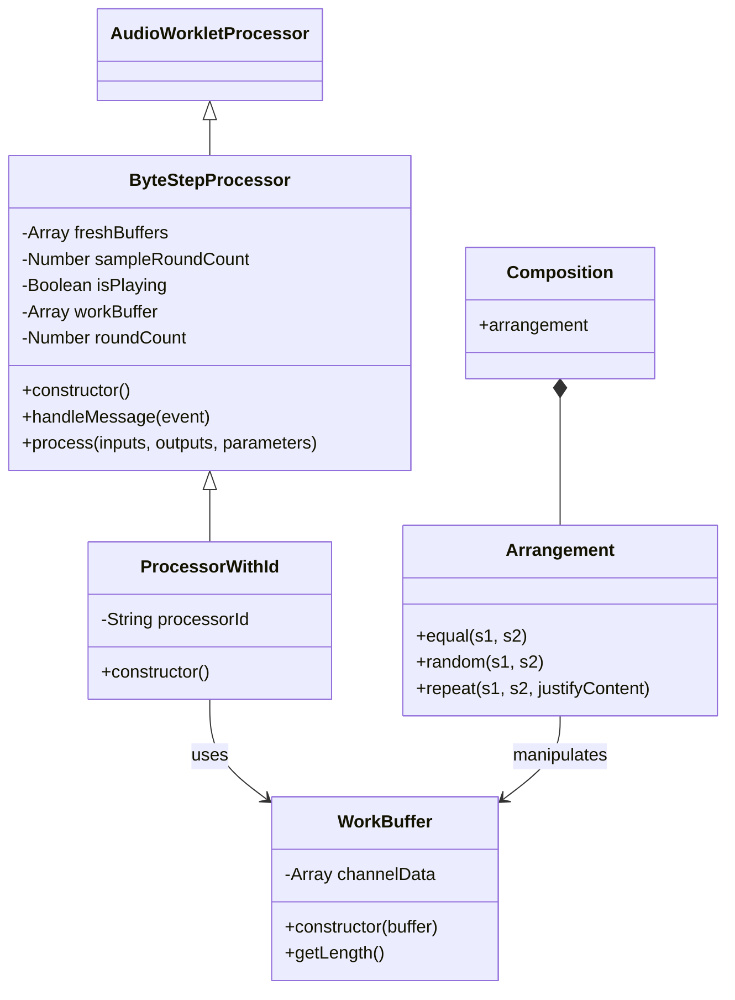

# Byte Composition

A web audio application that processes and arranges audio samples using Web Audio API and AudioWorklet.

## Class Architecture



## Component Description

### ByteStepProcessor
- Base audio processing class that extends AudioWorkletProcessor
- Handles audio buffer management and processing
- Manages playback state and buffer queues

### ProcessorWithId
- Extends ByteStepProcessor with identification capabilities
- Adds processor ID to all messages for multi-instance management
- Handles communication between main thread and audio worklet

### WorkBuffer
- Wrapper class for audio buffer data
- Manages channel data arrays
- Provides length calculation utilities

### Composition/Arrangement
- Handles audio sample arrangement algorithms
- Provides three arrangement methods:
  - `equal`: Makes two buffers equal in length
  - `random`: Applies random arrangement patterns
  - `repeat`: Repeats samples with customizable spacing

## Audio Processing Flow

1. Main thread loads audio samples
2. Samples are sent to AudioWorklet via messages
3. ByteStepProcessor receives and processes samples
4. Arrangement algorithms modify sample playback
5. Processed audio is output through Web Audio API

## Setup and Build

```bash
# Install dependencies
npm install

# Start development server
npm run dev
```

The application will be available at http://localhost:9001