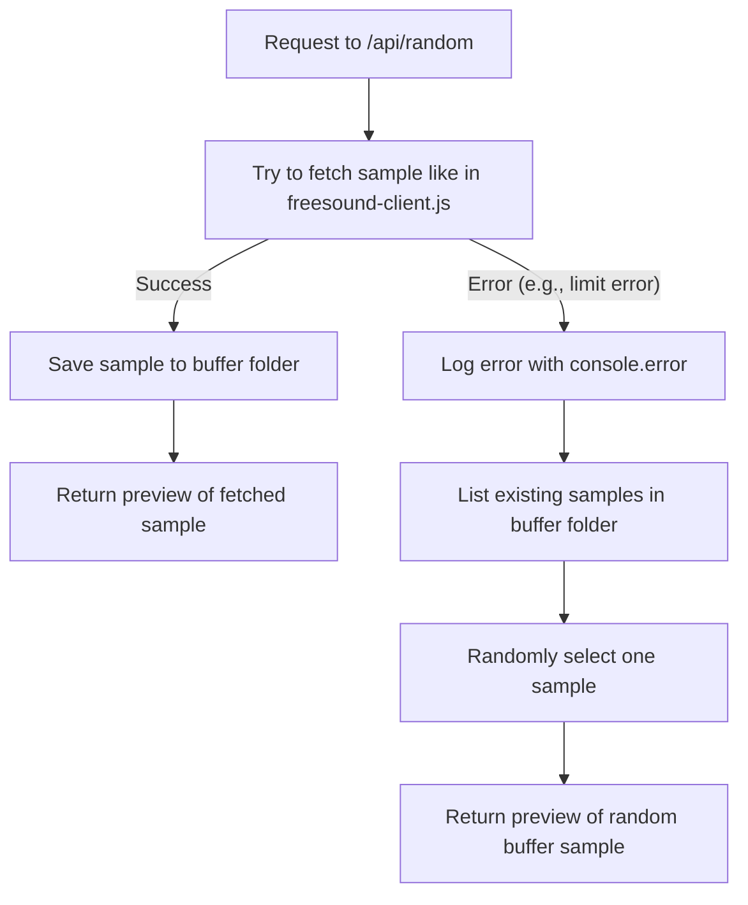

# Sample Server Plan

This document outlines the plan to create a Next.js project within the **sample-server/** directory, featuring two API endpoints. The endpoints will interface with the flat-db and infos modules and use a designated buffer folder to manage sample files.

---

## 1. Directory & Project Setup

- Create a new **sample-server/** directory at the project root.
- Initialize a Next.js project with a `package.json` that includes the following dependencies:
  - `next`
  - `react`
  - `react-dom`
  - `flat-db`
  - `infos`

---

## 2. File Structure

```
sample-server/
├── package.json             // Project configuration and dependencies.
├── pages/
│   └── api/
│       ├── samples.js       // API endpoint to list all samples using flat-db and infos.
│       └── random.js        // API endpoint to retrieve a sample.
└── buffer/                  // Folder to store successfully downloaded samples.
```

---

## 3. API Endpoints

### /api/samples.js

- **Purpose:**  
  Lists all samples stored in the flat-db.
  
- **Functionality:**
  - Loads sample data from flat-db (e.g., from a `db.json` file).
  - Integrates data from the infos module to enhance metadata.
  - Returns the list of sample entries in JSON format.
  - Implements error handling by logging errors via `console.error` and returning an error response when needed.

### /api/random.js

- **Purpose:**  
  Retrieves a sample using logic similar to `src/freesound-client.js`.

- **Functionality:**
  - Attempts to fetch a sample using the approach from `src/freesound-client.js`.
    - On success:  
      - Saves the sample to the **buffer/** folder.
      - Returns the preview of the fetched sample.
    - On error (e.g., limit error):
      - Logs the error via `console.error`.
      - Falls back to selecting a random sample from the **buffer/** folder and returns its preview.
  - Ensures robust error handling using try-catch blocks.

---

## 4. Process Flow Diagram



---

This plan serves as the blueprint for implementing the new Next.js project in **sample-server/**. It outlines how the API endpoints will work and handle errors, ensuring the application returns a valid sample preview under all conditions.